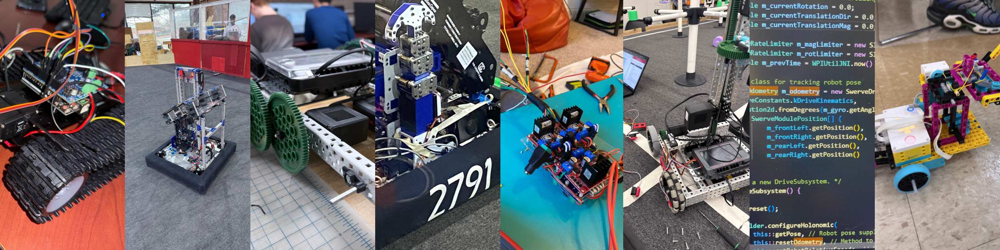

# Hi, I'm Kush 👋🏻

>
 Programmer • Experimenter • Learner 

Robotics Engineering Student at <a href="https://www.wpi.edu/" style="color: #AC2B37; font-family: Georgia;">Worcester Polytechnic Institute </a>

Passionate about robotics, automation, embedded systems

<a href="https://www.thebluealliance.com/team/2791" >🦬 First Robotics Team <b style="font-family: Courier;"> #2791</b></a> Alumni

### Currently working on    
Project D26-1: Learning 3D printing

Project D26-1: Computer vision with OpenCV

### Tech Stack 🦾
#### Programming & Web Development
- HTML
- CSS
- JavaScript
- API Integration
- Python
- Java
- Django
- Flask

#### Embedded Systems & Microcontrollers
- Arduino
- ESP-32
- Raspberry Pi
- Microcontroller Programming
- Sensor Integration
- Multimeter Usage

#### Electronics & Hardware
- Circuit Prototyping
- Soldering
- Wiring
- Multimeter Usage
- Sensor Integration

#### Robotics & Control
- Vex V5 Robotics
- PID Control
